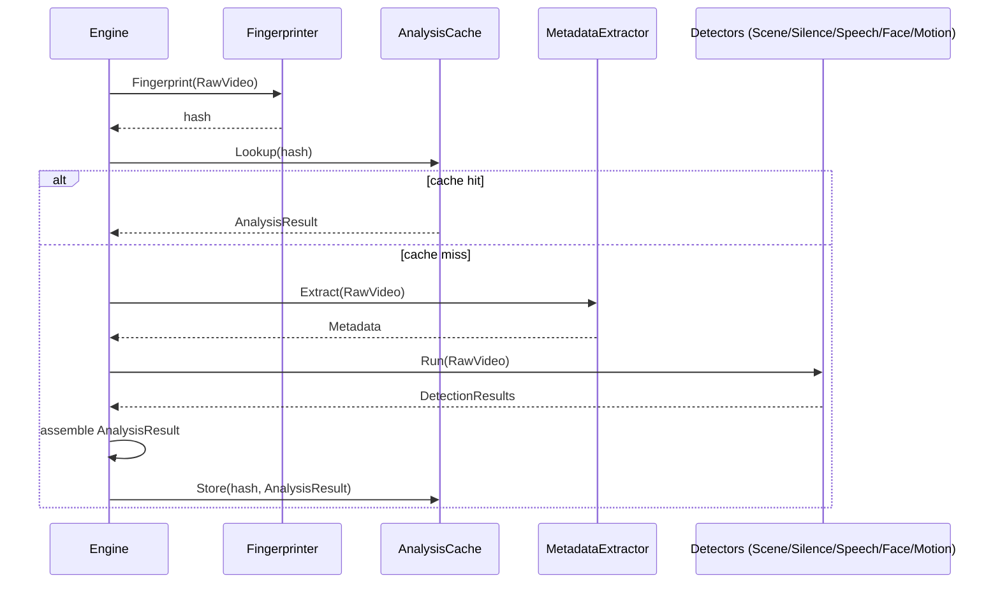
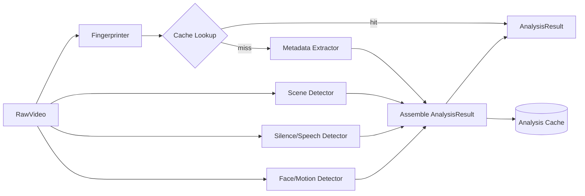

# Analyze

## Purpose

Analyze inspects a `RawVideo` and produces a structured, immutable `AnalysisResult` describing its content characteristics — metadata, scene boundaries, audio/silence structure, faces, motion, and a fingerprint hash. This is the only stage permitted to "look at" the video's content; every later stage reasons only about the `AnalysisResult`, never the raw bytes directly.

## Overview

Analyze is a pure transformation: `RawVideo → AnalysisResult`. It performs no editing and produces no output video. Its result is what makes intelligent, content-aware Recipe generation possible — without it, Recipe Generator would have no basis for decisions like "trim silence" or "avoid cutting mid-scene."

## Responsibilities

- Extracting container/codec/duration/resolution/framerate metadata
- Detecting scene boundaries (shot changes)
- Detecting speech segments and silence segments
- Detecting faces (presence/regions, not identity)
- Detecting motion intensity per segment
- Performing frame-level sampling analysis for downstream effect decisions
- Generating a content fingerprint hash (for duplicate-source detection and caching)
- Caching analysis results keyed by source fingerprint, to avoid re-analyzing an identical source

## Motivation

Centralizing all content inspection in one stage prevents duplicated, inconsistent detection logic from appearing in Recipe Generator, Variant, and Render independently. It also means expensive operations (scene detection, face detection) run exactly once per unique source, regardless of how many thousands of Variants are eventually generated from it.

## Scope

**In scope:** Metadata extraction, scene/silence/speech/face/motion detection, frame sampling, fingerprinting, result caching.

**Out of scope:** Any decision about what effects to apply (Recipe Generator's job); any modification of the video (Render's job).

## Design Goals

| Goal | Description |
|---|---|
| Determinism | The same RawVideo always produces the same AnalysisResult |
| Composability | Each detector (scene, silence, face, motion) is independent and can be enabled/disabled/replaced individually |
| Cacheable | Identical sources (by content fingerprint) never get re-analyzed |
| Bounded Cost | Analysis must have a predictable, boundable time/resource cost regardless of video length |

## High Level Design

```
RawVideo
   │
   ▼
Fingerprint Hash ──▶ Cache Lookup ──hit──▶ AnalysisResult (cached)
   │
  miss
   ▼
+------------------------------------------------+
| Metadata Extractor | Scene Detector | Silence   |
| Detector | Speech Detector | Face Detector      |
| Motion Detector | Frame Sampler                  |
+------------------------------------------------+
   │
   ▼
AnalysisResult (assembled, cached, returned)
```

## Architecture

```
+-----------------------------------------------------+
|                 Analyze Domain Core                   |
|  AnalysisResult (value object) · Detector (interface) |
+-----------------------------------------------------+
        ▲              ▲              ▲
        │ port          │ port         │ port
+---------------+ +---------------+ +------------------+
| Detector       | | Fingerprinter | | AnalysisCache     |
| (per-kind port)| | (port)        | | (port)            |
+---------------+ +---------------+ +------------------+
        ▲              ▲              ▲
+---------------+ +---------------+ +------------------+
| FFprobeMetadata| | PerceptualHash | | FileAnalysisCache |
| PySceneDetectAd.| | Fingerprinter | | SQLiteCache        |
| SilenceDetectAd.|                  +------------------+
| FaceDetectAd.   |
+---------------+
```

## Components

| Component | Responsibility |
|---|---|
| Metadata Extractor | Reads container-level facts: duration, resolution, framerate, codec, bitrate |
| Scene Detector | Identifies shot/scene boundary timestamps |
| Silence Detector | Identifies audio silence intervals |
| Speech Detector | Identifies intervals containing speech (as opposed to music/silence/noise) |
| Face Detector | Identifies frame regions/timestamps containing faces (presence only, not identity) |
| Motion Detector | Scores motion intensity per segment, informing effect pacing decisions later |
| Frame Sampler | Extracts representative frames at configured intervals for any detector needing visual sampling |
| Fingerprinter | Produces a content hash used for caching and duplicate-source detection |
| Analysis Cache | Stores/retrieves AnalysisResult keyed by fingerprint |

## Internal Flow

1. Analyze receives `RawVideo` from Context.
2. Fingerprinter computes a content hash of the source.
3. Analysis Cache is checked; on a hit, the cached `AnalysisResult` is returned immediately.
4. On a miss, Metadata Extractor and all enabled Detectors run (independently, potentially concurrently) against the RawVideo.
5. Results from all detectors are assembled into one immutable `AnalysisResult`.
6. The result is written to Analysis Cache keyed by fingerprint, then returned in the updated Context.

## Sequence



## Data Flow



## Interfaces

- **Analyzer** (Stage implementation)
  - `Execute(ctx Context) (Context, error)` — reads RawVideo, writes AnalysisResult
- **Detector** (common interface for all detector kinds)
  - `Detect(video RawVideo) (DetectionResult, error)`
- **Fingerprinter**
  - `Fingerprint(video RawVideo) (Hash, error)`
- **AnalysisCache**
  - `Lookup(hash Hash) (AnalysisResult, bool)`
  - `Store(hash Hash, result AnalysisResult) error`

## Dependencies

| Depends on | Why |
|---|---|
| Download (RawVideo) | Analyze's sole input |
| Pipeline (Stage, Context) | Implements the Stage contract |
| Storage/Cache | Persists AnalysisResult for reuse |
| Configuration | Which detectors are enabled, sampling intervals, thresholds |

**Depended on by:** Recipe (Recipe Generator consumes AnalysisResult).

## Extension Points

- New detector kinds (e.g. logo detection, aspect-ratio detection) can be added by implementing `Detector` and registering with the Analyze orchestration, without touching existing detectors.
- Detector implementations can be swapped (e.g. a different scene-detection algorithm) behind the same `Detector` interface.

## Risks

- **Detector cost variance** — face/motion detection can be significantly more expensive than metadata extraction; running all detectors unconditionally on very long videos could be slow. Mitigated by configurable detector enablement and frame-sampling rate limits.
- **False positives/negatives** — imperfect detection (e.g. missed silence, misdetected scene cuts) propagates into Recipe decisions. Mitigated by exposing confidence scores per detection, so Recipe Generator can apply its own thresholds.
- **Cache invalidation** — if a detector's algorithm changes, previously cached AnalysisResults become stale relative to the new logic. Mitigated by including a detector-version identifier in the cache key.

## Best Practices

- Every detector must be independently testable against a fixture video, without requiring the full Analyze pipeline.
- Detection results must include confidence/quality indicators, not just raw booleans, wherever the underlying method supports it.
- Never mutate `RawVideo` — Analyze is strictly read-only with respect to the source file.

## Future Work

- GPU-accelerated detection for large batch throughput.
- Speech-to-text transcription as an additional detector, feeding future Subtitle generation.
- Object/logo detection for smarter watermark/overlay placement decisions.

## References

- Download.md
- Recipe.md
- Pipeline.md
