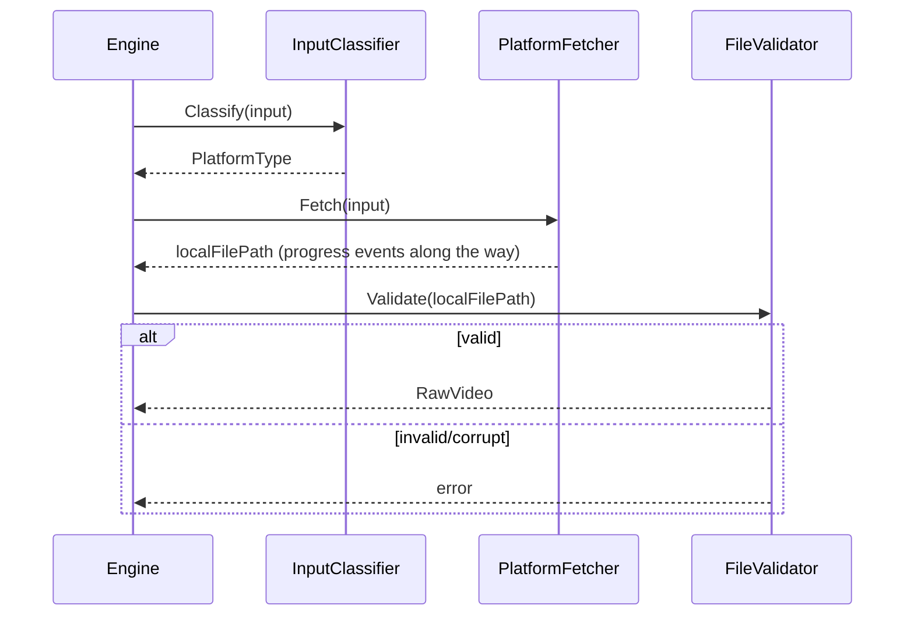
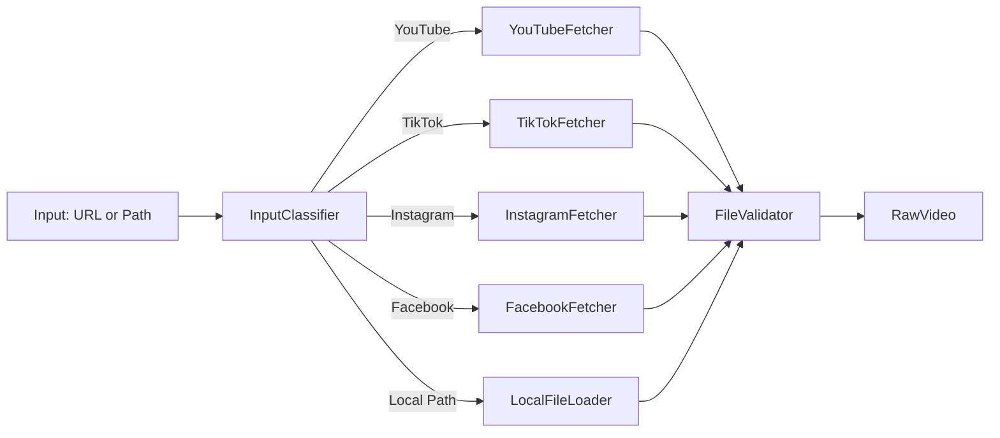

# Download

## Purpose

Download is the sole entry point for acquiring source video bytes into the system, regardless of origin. It normalizes YouTube, TikTok, Instagram, Facebook, and local file inputs into one uniform `RawVideo` output, so every downstream stage never needs to know or care where the source came from.

## Overview

Download's job ends the moment a valid, verified local video asset exists on disk (or in configured storage) and is described by a `RawVideo` value object. It performs no analysis, no transformation, and no decision-making about content — only acquisition, verification, and normalization.

## Responsibilities

- Detecting input type (URL platform vs local file path)
- Delegating to the correct platform-specific fetcher (YouTube, TikTok, Instagram, Facebook)
- Validating downloaded/local files (playable, non-corrupt, within configured size/duration limits)
- Normalizing output into a single `RawVideo` value object regardless of source
- Reporting download progress for long-running fetches
- Handling transient network failures with retry

## Motivation

Without a dedicated Download boundary, platform-specific fetching logic (yt-dlp-style extraction, TikTok's API quirks, Instagram auth requirements) would leak into Analyze or Engine, coupling the rest of the system to external platform APIs that change frequently and independently of the core pipeline.

## Scope

**In scope:** Input type detection, platform-specific fetch adapters, local file ingestion, output validation, download progress reporting.

**Out of scope:** Any interpretation of video content (Analyze), any transformation of the video (Render), persistence policy beyond placing the file where Storage expects it.

## Design Goals

| Goal | Description |
|---|---|
| Uniform Output | Every input type, however different its acquisition path, produces the same `RawVideo` shape |
| Fail Clearly | Unsupported URLs, geo-blocked content, or corrupt files must fail with an actionable, specific error |
| Resilience | Transient network errors are retried; permanent errors (invalid URL, deleted video) are not |
| No Silent Truncation | A partially downloaded file must never be treated as valid output |

## High Level Design

```
Input (URL or Path)
        │
        ▼
  Input Classifier
        │
   ┌────┼─────┬─────────┬───────────┐
   ▼    ▼     ▼         ▼           ▼
YouTube TikTok Instagram Facebook LocalFile
Fetcher Fetcher Fetcher  Fetcher   Loader
   │    │     │         │           │
   └────┴─────┴─────────┴───────────┘
                │
                ▼
        Validation & Normalization
                │
                ▼
             RawVideo
```

## Architecture

```
+--------------------------------------------------+
|                Download Domain Core                |
|  RawVideo (value object) · InputClassifier          |
+--------------------------------------------------+
        ▲                    ▲
        │ port               │ port
+---------------+     +------------------+
| PlatformFetcher|     | FileValidator    |
| (port)         |     | (port)           |
+---------------+     +------------------+
        ▲                    ▲
+---------------+     +------------------+
| YouTubeFetcher |     | FFprobeValidator |
| TikTokFetcher   |    | (adapter)        |
| InstagramFetcher|    +------------------+
| FacebookFetcher |
| LocalFileLoader |
+---------------+
```

## Components

| Component | Responsibility |
|---|---|
| Input Classifier | Determines input type from a raw string (URL pattern matching, or local path detection) |
| Platform Fetcher (per platform) | Encapsulates platform-specific acquisition logic behind a common interface |
| Local File Loader | Validates and registers an existing local file as a source, without network access |
| File Validator | Confirms the acquired file is playable, non-corrupt, and within configured limits (max duration, max size, supported codec) |
| Progress Reporter | Emits download progress events for long-running fetches |
| RawVideo | The uniform output value object: file path, duration, container format, checksum, source metadata |

## Internal Flow

1. Engine passes raw input string to Download.
2. Input Classifier determines the platform (or "local file").
3. The corresponding Platform Fetcher (or Local File Loader) is invoked.
4. On completion, File Validator inspects the resulting file for integrity and constraint compliance.
5. If valid, a `RawVideo` value object is constructed and returned in the updated Context.
6. If invalid or fetch failed permanently, a specific, attributable error is returned and the pipeline halts.

## Sequence



## Data Flow



## Interfaces

- **Downloader** (Stage implementation)
  - `Execute(ctx Context) (Context, error)` — reads input from Context, writes RawVideo back
- **PlatformFetcher**
  - `Fetch(input string, progress chan<- ProgressEvent) (filePath string, error)`
- **FileValidator**
  - `Validate(filePath string) (RawVideo, error)`

## Dependencies

| Depends on | Why |
|---|---|
| Pipeline (Stage, Context) | Implements the Stage contract |
| Storage | Where downloaded/validated files are placed |
| Configuration | Max duration/size limits, allowed platforms, retry policy |

**Depended on by:** Engine (first stage in sequence), Analyze (consumes RawVideo).

## Extension Points

- New platforms are added by implementing `PlatformFetcher` and registering with the Input Classifier — no existing fetcher is touched.
- Alternative FileValidator strategies (stricter codec allowlists, different size limits) can be swapped via configuration.

## Risks

- **Platform API instability** — YouTube/TikTok/Instagram extraction methods change frequently and can break without warning. Mitigated by isolating each platform behind its own Fetcher adapter, so breakage is contained to one adapter.
- **Partial downloads treated as valid** — a truncated file passed downstream could corrupt Analyze results. Mitigated by mandatory FileValidator checksum/duration verification before returning RawVideo.
- **Legal/ToS considerations** — downloading from some platforms may be subject to their Terms of Service; this is a policy decision outside the scope of this document and should be tracked as an ADR.

## Best Practices

- Never return a `RawVideo` for a file that hasn't passed validation.
- Retry only on classified-transient errors (network timeout); never retry on classified-permanent errors (404, private video).
- Keep platform credentials/config out of the Fetcher code itself — inject via Configuration.

## Future Work

- Parallel chundone downloading for large files.
- Resume-from-partial-download support.
- Pluggable rate-limiting per platform to respect API/ToS constraints.

## References

- Pipeline.md
- Analyze.md
- Engine.md
