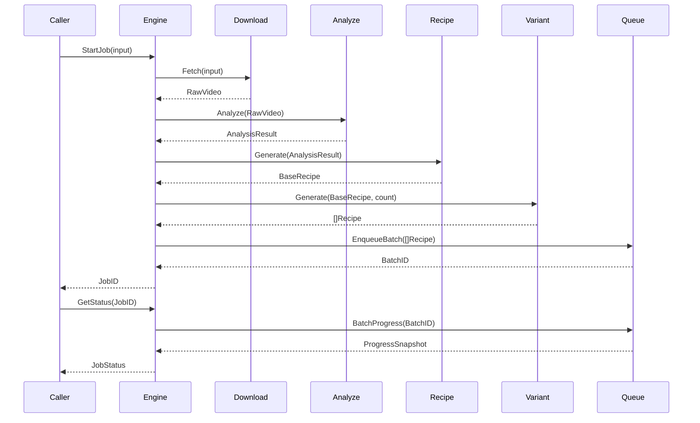
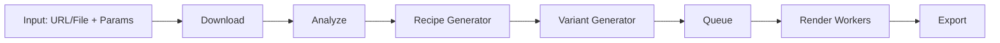

# Engine

## Purpose

Engine is the single entry point that owns the lifecycle of a video remix job from submission to completion. It does not implement Download, Analyze, Recipe, Variant, Queue, or Render logic itself — it orchestrates calls to each stage through well-defined interfaces and exposes a small, stable public API to callers (CLI today, Desktop UI in the future).

## Overview

Engine is the Facade over the entire pipeline. A caller interacts with exactly three methods — `StartJob`, `CancelJob`, `GetStatus` — regardless of how many internal stages or how many thousands of Variants a single job produces. Engine's job is coordination and lifecycle management, not domain logic.

## Responsibilities

- Accepting a job submission (source input + generation parameters)
- Driving the source through Download → Analyze → Recipe → Variant in sequence
- Handing the resulting batch of Recipes to Queue for scheduled rendering
- Exposing aggregate status across an entire batch
- Propagating cancellation down through Queue to in-flight Workers
- Ensuring each stage only receives the Context it needs, never internal state of other stages

## Motivation

Without a central Engine, every caller (CLI, future Desktop app) would need to know the exact sequence and wiring of internal stages, coupling presentation layers directly to pipeline internals. Engine keeps that sequence in exactly one place, so pipeline stages can be reordered, added, or replaced without touching any caller.

## Scope

**In scope:** Job lifecycle orchestration, stage sequencing, Context propagation, top-level cancellation, aggregate status reporting.

**Out of scope:** The internal implementation of any individual stage; UI; persistence details (delegated to Storage); scheduling internals (delegated to Queue).

## Design Goals

| Goal | Description |
|---|---|
| Minimal Public Surface | Three methods total; no stage-specific leakage into the public API |
| Stage Independence | Engine calls stages only through their interfaces, never their concrete types |
| Fail Fast, Fail Clear | A failure in any stage halts the job with a clear, attributable error, not a silent partial result |
| Cancellable at Any Point | A cancellation request must be honored whether the job is downloading, analyzing, or mid-render |

## High Level Design

```
StartJob(input)
     │
     ▼
 Download ──▶ Analyze ──▶ Recipe ──▶ Variant ──▶ Queue.Enqueue(many) ──▶ Render (async)
     │            │           │          │              │
     └────────────┴───────────┴──────────┴──────────────┴──▶ shared Context
```

Engine treats stages 1–4 (Download, Analyze, Recipe, Variant) as synchronous, sequential steps producing an ever-growing Context, and stage 5 onward (Queue/Render) as an asynchronous fan-out that Engine monitors but does not block on.

## Architecture

```
+----------------------------------------------------------+
|                        Engine (Facade)                    |
|  StartJob() · CancelJob() · GetStatus()                   |
+----------------------------------------------------------+
        │ calls via interface, not concrete type
        ▼
+-----------+  +-----------+  +---------+  +---------+  +-------+
| Download  |->| Analyze   |->| Recipe  |->| Variant |->| Queue |
| (port)    |  | (port)    |  | (port)  |  | (port)  |  | (port)|
+-----------+  +-----------+  +---------+  +---------+  +-------+
```

## Components

| Component | Responsibility |
|---|---|
| Engine Facade | Public API surface (`StartJob`, `CancelJob`, `GetStatus`) |
| Job Orchestrator | Internal sequencing logic driving stages 1–4 synchronously |
| Context | Immutable, append-only carrier of data passed between stages |
| Status Aggregator | Combines Queue-level batch progress into a single JobStatus for callers |
| Cancellation Propagator | Translates a top-level CancelJob into stage-appropriate cancellation signals |

## Internal Flow

1. Caller invokes `StartJob(input)` with a source reference (URL or local file) and generation parameters.
2. Engine invokes Download, producing `RawVideo`, appended to Context.
3. Engine invokes Analyze with the Context, producing `AnalysisResult`.
4. Engine invokes Recipe Generator, producing a baseline Frozen Recipe.
5. Engine invokes Variant, producing N Frozen Recipes from the baseline.
6. Engine enqueues all N Recipes via Queue and returns a `JobID` immediately — rendering proceeds asynchronously.
7. Caller polls or subscribes via `GetStatus(jobID)` for aggregate progress.
8. Caller may call `CancelJob(jobID)` at any point; Engine propagates cancellation to whichever stage is currently active.

## Sequence



## Data Flow



## Interfaces

- **Engine**
  - `StartJob(input JobInput) (JobID, error)`
  - `CancelJob(id JobID) error`
  - `GetStatus(id JobID) (JobStatus, error)`
- Internal stage ports consumed by Engine: `Downloader`, `Analyzer`, `RecipeGenerator`, `VariantGenerator`, `QueueService` (each defined in its own module document).

## Dependencies

| Depends on | Why |
|---|---|
| Download, Analyze, Recipe, Variant, Queue | Orchestrates each in sequence/fan-out |
| Configuration | Job defaults (variant count, priority) |
| Logging | Structured logs at every stage transition |

**Depended on by:** CLI (today), Desktop UI (future).

## Extension Points

- New pipeline stages can be inserted by extending the Job Orchestrator's sequence without changing the public Engine API.
- Alternative Status Aggregator strategies (e.g. per-stage granular progress vs simple percentage).

## Risks

- **Partial failure ambiguity** — if Variant produces 500 Recipes and only 3 fail validation, Engine must decide whether to proceed with 497 or halt entirely; this policy must be explicit, not incidental.
- **Long-lived synchronous stages** — Download/Analyze on a very large source could block `StartJob` for a long time; future versions may need to make even these asynchronous.

## Best Practices

- Engine must never import concrete stage implementations directly — only interfaces, injected at construction time.
- Every Context handoff between stages must be immutable; a stage may only append, never mutate prior data.
- All cancellation checks must be cooperative and checked at stage boundaries at minimum.

## Future Work

- Asynchronous Download/Analyze for very large sources.
- Multi-job orchestration dashboard (batch-of-batches).
- Pluggable orchestration policies (e.g. partial-success thresholds).

## References

- Pipeline.md
- Download.md
- Analyze.md
- Recipe.md
- Variant.md
- Queue.md
- Render.md
