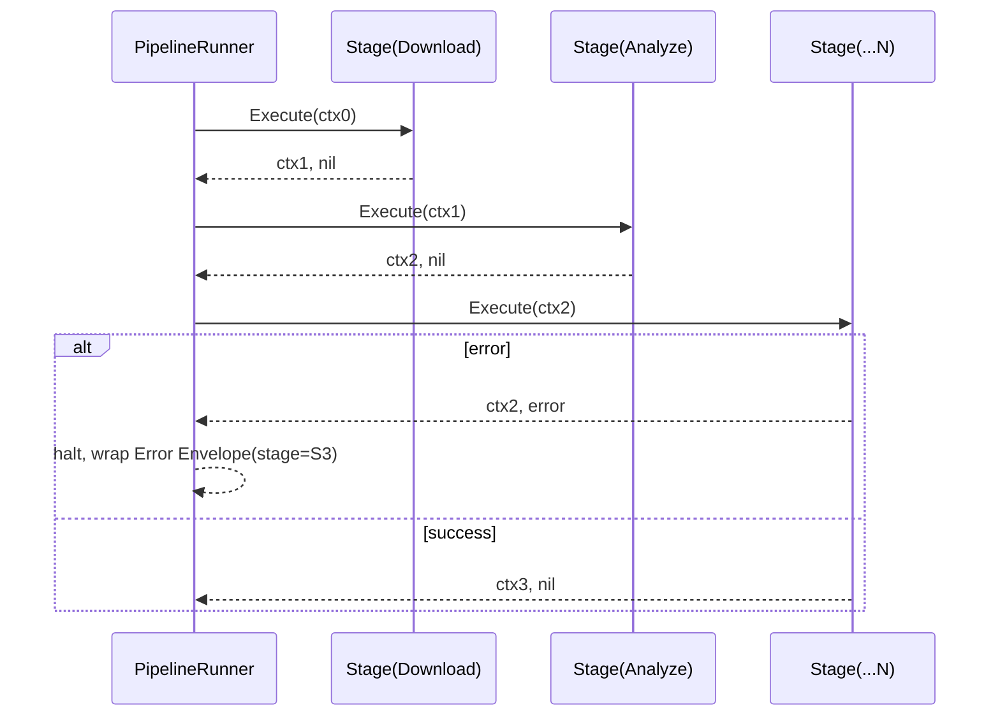

# Pipeline

## Purpose

Pipeline defines the structural contract that every stage (Download, Analyze, Recipe, Variant, Queue, Render, Export) must conform to, and the shared Context mechanism through which stages communicate. This document is the architectural constitution binding all stages together — it does not implement any stage itself.

## Overview

The system is built as a strict, ordered Pipeline of independent stages. Each stage is a black box to every other stage: it accepts a Context, performs its transformation, and returns an updated Context. No stage may reach into another stage's internals, call another stage's dependencies directly, or share mutable state outside the Context.

## Responsibilities

- Defining the `Stage` interface every pipeline step must implement
- Defining the `Context` type used to pass data between stages
- Enforcing stage ordering and immutability of Context handoffs
- Providing a common error-propagation contract so any stage's failure halts the pipeline predictably

## Motivation

A video remix system with seven-plus stages, each independently developed and testable, needs a shared contract or it degenerates into ad-hoc function calls with implicit ordering assumptions. Formalizing "Stage" and "Context" as first-class concepts is what makes it possible to add, remove, reorder, or replace stages (e.g. swapping the Analyze implementation) without a ripple effect across the rest of the system.

## Scope

**In scope:** The Stage interface, the Context data carrier, ordering/sequencing rules, error propagation contract.

**Out of scope:** What any individual stage does internally (see each stage's own document); orchestration policy (see Engine).

## Design Goals

| Goal | Description |
|---|---|
| Stage Isolation | A stage may only depend on the Context it receives — never on another stage's types or internals |
| Immutability | Context is append-only; a stage never mutates fields written by a previous stage |
| Uniform Error Contract | Any stage returns `(Context, error)`; a non-nil error halts the pipeline uniformly |
| Testability | Any stage can be tested in isolation by constructing a synthetic Context |

## High Level Design

```
Context₀ ──▶ [Download]  ──▶ Context₁ ──▶ [Analyze] ──▶ Context₂ ──▶ [Recipe]
   ──▶ Context₃ ──▶ [Variant] ──▶ Context₄ ──▶ [Queue] ──▶ Context₅ ──▶ [Render]
   ──▶ Context₆ ──▶ [Export] ──▶ Context₇ (final)
```

Each arrow is a call through the uniform `Stage` interface; each `Contextₙ` is a distinct, immutable value — not the same object mutated in place.

## Architecture

```
+---------------------------------------------------+
|                  Stage Interface                    |
|   Execute(ctx Context) (Context, error)              |
+---------------------------------------------------+
        ▲            ▲            ▲            ▲
        │            │            │            │
   +---------+  +---------+  +---------+  +---------+
   |Download |  |Analyze  |  |Recipe   |  |Variant  |  ... etc
   |Stage    |  |Stage    |  |Stage    |  |Stage    |
   +---------+  +---------+  +---------+  +---------+
```

## Components

| Component | Responsibility |
|---|---|
| Stage (interface) | Uniform contract every pipeline step implements |
| Context (value object) | Immutable, typed, append-only carrier of data between stages |
| Pipeline Runner | Sequences a fixed list of Stages, threading Context through each in order |
| Error Envelope | Wraps a stage's failure with which stage produced it, for attribution |

## Internal Flow

1. Pipeline Runner is constructed with an ordered list of Stage implementations.
2. Runner starts with an initial Context (containing only the job input).
3. For each Stage in order: Runner calls `Execute(ctx)`; on success, the returned Context replaces the current one; on error, the Runner halts and returns an Error Envelope identifying the failing stage.
4. The final Context, after the last Stage, contains everything needed for Export.

## Sequence



## Data Flow


## Interfaces

- **Stage**
  - `Execute(ctx Context) (Context, error)`
- **Context**
  - `With(key ContextKey, value any) Context` — returns a new Context with an added field, original untouched
  - `Get(key ContextKey) (any, bool)`
- **PipelineRunner**
  - `Run(stages []Stage, initial Context) (Context, error)`

## Dependencies

| Depends on | Why |
|---|---|
| None (foundational) | Pipeline is the lowest-level shared contract; it depends on nothing else in the domain |

**Depended on by:** Engine, Download, Analyze, Recipe, Variant, Queue, Render, Export — every stage implements `Stage` and every orchestrator uses `PipelineRunner`.

## Extension Points

- New stages can be added to the pipeline by implementing `Stage` and inserting them into the Runner's ordered list — no existing stage needs modification.
- Alternative Context implementations (e.g. one backed by structured logging spans) can be swapped without changing any Stage's code, as long as `With`/`Get` semantics hold.

## Risks

- **Context bloat** — an ever-growing Context across many stages could become an unstructured grab-bag. Mitigated by typed accessor keys and per-stage documented Context contracts (what each stage reads/writes).
- **Silent field shadowing** — if two stages accidentally use the same Context key, one could overwrite the other's data. Mitigated by namespacing keys per stage (e.g. `download.rawVideoPath`).

## Best Practices

- Every Stage must be a pure function of its input Context plus its own injected dependencies — no hidden global state.
- Context must never be mutated in place; always return a new value from `With`.
- Every Stage must be independently unit-testable with a hand-constructed Context, without needing the full pipeline running.

## Future Work

- Parallel/branching pipeline support (for stages that could run concurrently rather than strictly sequentially).
- Structured tracing built into Context propagation for cross-stage observability.

## References

- Engine.md
- Download.md
- Analyze.md
- Recipe.md
- Variant.md
- Queue.md
- Render.md
