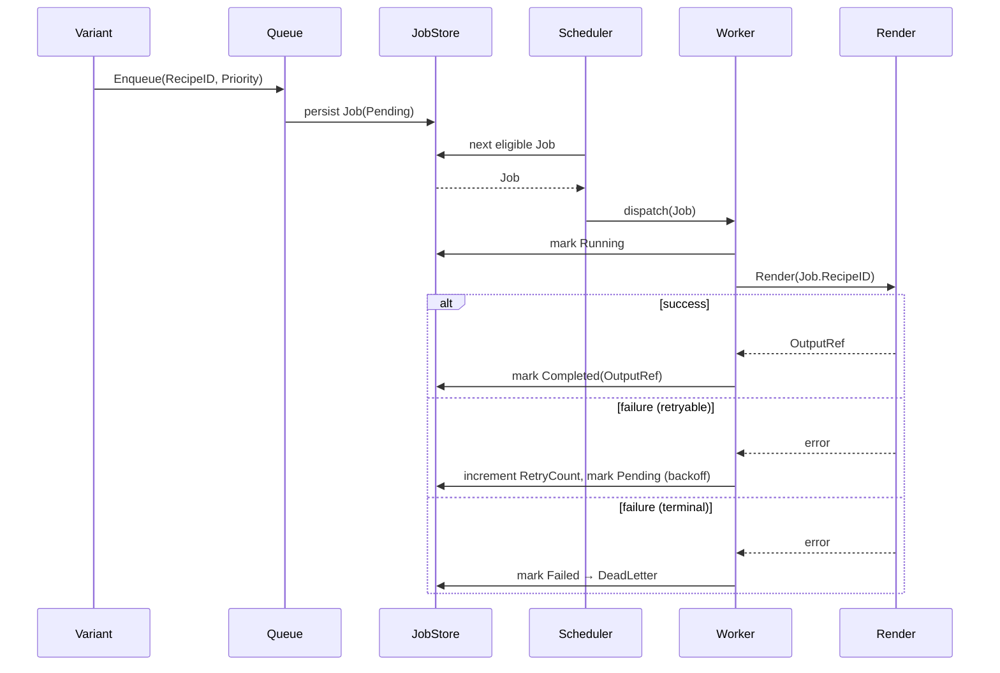
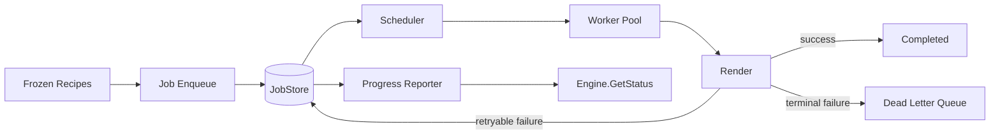

# Queue

## Purpose

The Queue module is the scheduling boundary between "a Frozen Recipe exists and is ready to render" and "a worker is actively rendering it." It owns job lifecycle, concurrency control, retries, prioritization, and cancellation — but it owns none of the rendering logic itself. Queue turns an arbitrarily large batch of Variant-generated Recipes into a controlled, observable, resumable stream of work for the Render stage.

## Overview

Given that a single source video may fan out into thousands of Variants, the Queue module exists to prevent the system from attempting to render all of them simultaneously, to survive partial failures without losing progress, and to give callers (Engine, CLI, future UI) visibility into what's happening. Queue treats each Recipe-to-render as a `Job`: an immutable unit of work with its own state machine, independent of the Job before or after it.

## Responsibilities

- Accepting Jobs (one per Recipe) and assigning them stable Job IDs
- Managing a pool of stateless Workers that pull Jobs and hand them to Render
- Enforcing concurrency limits (max parallel renders)
- Retrying failed Jobs up to a configured limit with backoff
- Routing permanently-failed Jobs to a Dead Letter Queue
- Supporting priority ordering (e.g. user-initiated single preview renders ahead of bulk batch jobs)
- Reporting progress per Job and in aggregate for a batch
- Supporting cancellation of individual Jobs or entire batches
- Supporting resume of a batch after process restart, using durable Job state

## Motivation

Without a dedicated Queue, the Engine would be forced to either render everything synchronously (unacceptable at thousands-of-variants scale) or hand-roll goroutine management, retry logic, and progress tracking inline — which is exactly the kind of incidental complexity that leaks across module boundaries. Isolating this into Queue keeps Render workers "dumb" (pure function: Recipe + RawVideo in, MP4 out) and keeps all scheduling policy in one place.

## Scope

**In scope:** Job state machine, Worker pool management, retry/backoff policy, priority ordering, Dead Letter handling, progress reporting, cancellation, persistence of Job state for resume.

**Out of scope:** How a Job is actually rendered (Render), how Recipes are produced (Recipe/Variant), long-term storage of output files (Storage).

## Design Goals

| Goal | Description |
|---|---|
| Backpressure | Never allow unbounded concurrent renders regardless of batch size |
| Resilience | A crashed process must be able to resume in-flight and pending Jobs |
| Observability | Every Job's state must be queryable at any time |
| Isolation | Workers must not share mutable state; each Job is processed independently |
| Fairness | Priority Jobs must not starve normal-priority batch Jobs indefinitely |

## High Level Design

```
Variant Output (many Recipes)
        │
        ▼
  Job Enqueue ──▶ Job Store (durable) ──▶ Priority Scheduler
                                                │
                                                ▼
                                          Worker Pool (N workers)
                                                │
                                                ▼
                                        Render (per Job)
                                          │        │
                                     success     failure
                                          │        │
                                          ▼        ▼
                                     Completed   Retry (≤ max) ──▶ Dead Letter
```

## Architecture

```
+--------------------------------------------------------+
|                     Queue Domain Core                   |
|   Job (entity) · JobState (value object)                |
|   RetryPolicy (value object) · Scheduler (domain service)|
+--------------------------------------------------------+
        ▲                    ▲                  ▲
        │ port               │ port             │ port
+---------------+   +------------------+   +------------------+
| JobStore      |   | WorkerDispatcher |   | ProgressReporter |
| (port)        |   | (port)           |   | (port)           |
+---------------+   +------------------+   +------------------+
        ▲                    ▲                  ▲
+---------------+   +------------------+   +------------------+
| BoltDB/SQLite |   | GoroutinePool    |   | EventBusReporter |
| JobStore      |   | Dispatcher       |   | (adapter)        |
+---------------+   +------------------+   +------------------+
```

## Components

| Component | Responsibility |
|---|---|
| Job | Immutable value describing one render task: RecipeID, Priority, RetryCount, State, Timestamps |
| Job Store | Durable persistence of Job state, enabling resume after restart |
| Scheduler | Selects the next Job to dispatch based on priority and fairness rules |
| Worker Pool | Fixed-size pool of stateless workers pulling Jobs from the Scheduler |
| Retry Policy | Defines max attempts, backoff curve, and which errors are retryable vs terminal |
| Dead Letter Queue | Holds Jobs that exhausted retries, for manual inspection or reprocessing |
| Progress Reporter | Emits Job/batch progress events consumable by Engine.GetStatus() |
| Cancellation Token | Per-Job or per-batch signal that Workers check cooperatively between steps |

## Internal Flow

1. Variant stage produces N Frozen Recipes; Engine enqueues one Job per Recipe.
2. Job Store persists each Job in `Pending` state.
3. Scheduler selects the next eligible Job respecting priority and concurrency limits.
4. An available Worker claims the Job, transitions it to `Running`, and invokes Render.
5. On success: Job → `Completed`, output reference recorded.
6. On failure: if `RetryCount < MaxRetries` and the error is retryable, Job → `Pending` with backoff; otherwise Job → `Failed` and routed to Dead Letter.
7. Progress Reporter emits an event on every state transition.
8. On process restart, Job Store is scanned for any `Running` or `Pending` Jobs and they re-enter the Scheduler.

## Sequence



## Data Flow



## Interfaces

- **QueueService**
  - `Enqueue(recipeID RecipeID, priority Priority) (JobID, error)`
  - `Cancel(jobID JobID) error`
  - `CancelBatch(batchID BatchID) error`
  - `Status(jobID JobID) (JobState, error)`
- **JobStore**
  - `Save(job Job) error`
  - `Get(id JobID) (Job, error)`
  - `ListByState(state JobState) ([]Job, error)`
- **WorkerDispatcher**
  - `Dispatch(job Job) (RenderResult, error)`
- **ProgressReporter**
  - `Subscribe(batchID BatchID) (<-chan ProgressEvent, error)`

## Dependencies

| Depends on | Why |
|---|---|
| Recipe (Frozen Recipes) | Every Job references a RecipeID |
| Render | Worker Dispatcher delegates actual rendering |
| Storage | Job Store persists durable Job state |
| Configuration | Concurrency limits, retry policy, priority weights |

**Depended on by:** Engine (StartJob/GetStatus/CancelJob delegate here).

## Extension Points

- Alternative JobStore adapters (in-memory for tests, SQLite/BoltDB for production, distributed store for render farms).
- Pluggable RetryPolicy implementations (fixed backoff, exponential, jitter).
- Alternative Scheduler strategies (strict priority, weighted fair queuing, deadline-aware).

## Risks

- **Worker starvation** — a naive strict-priority scheduler can starve low-priority batch Jobs indefinitely. Mitigated by weighted fair queuing.
- **Retry storms** — retrying non-idempotent failures could waste compute repeatedly. Mitigated by classifying errors as retryable vs terminal at the Render boundary.
- **Job Store as bottleneck** — a single-writer store under high enqueue throughput could serialize progress. Mitigated by batched writes and async persistence where safe.

## Best Practices

- Jobs are immutable once created; state transitions produce new state records, not in-place field mutation.
- Workers must be stateless — no Job-specific state survives past the Job's completion.
- Cancellation must be cooperative and checked at safe points, never a hard kill of an in-flight render.
- Every state transition must be persisted before being reported, to avoid inconsistent resume behavior.

## Future Work

- Distributed Queue backend (e.g. NATS/Redis-based) for multi-machine scaling.
- Per-Job resource estimation to inform smarter scheduling.
- Web-based Dead Letter inspection and manual replay tooling.

## References

- Recipe.md
- Render.md
- Engine.md
- Pipeline.md
