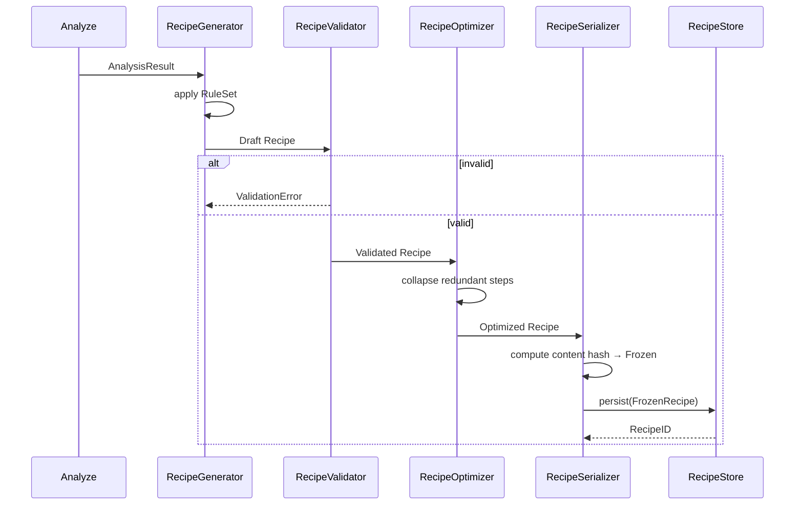
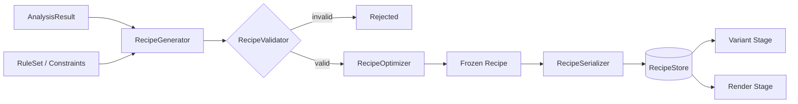

# Recipe

## Purpose

The Recipe module defines the single, immutable, serializable contract that describes **how one specific output video should be produced** from a source video. A Recipe is not an effect and not a render job — it is the declarative instruction set that sits between analysis (what the video *is*) and rendering (what FFmpeg actually *does*). Every other stage in the pipeline either produces a Recipe (Recipe Generator), transforms it into many Recipes (Variant), or consumes it (Render, Queue). Getting this contract right is the single highest-leverage design decision in the entire system.

## Overview

A Recipe is a versioned, validated, content-addressable document that captures:

- Which source asset it applies to
- Which timeline segments are used, trimmed, or discarded
- Which effects/plugins are applied, in what order, with what parameters
- Which constraints and rules were used to generate it
- A deterministic seed, so the same seed + same source always reproduces the same Recipe

Recipes are treated as **data, not behavior**. No Recipe ever calls code directly; it only describes intent. This keeps the Recipe subsystem fully decoupled from the Render and Effect subsystems — a Recipe can be validated, stored, diffed, and versioned without ever touching FFmpeg.

## Responsibilities

The Recipe subsystem owns:

- **Definition** — the canonical schema for a Recipe document
- **Generation** — producing a baseline Recipe from an Analysis Result
- **Validation** — rejecting Recipes that violate structural or business rules
- **Serialization** — converting Recipes to/from a durable, portable format
- **Versioning** — tracking schema evolution without breaking old Recipes
- **Storage** — persisting Recipes and retrieving them by ID
- **Caching** — avoiding redundant regeneration of equivalent Recipes
- **Execution Description** — exposing an ordered, resolved plan that the Render stage can consume without interpretation
- **Optimization** — collapsing redundant or conflicting effect operations before execution
- **Randomization Hooks** — exposing deterministic seed-based mutation points for the Variant stage

The Recipe subsystem does **not** own: effect implementation, FFmpeg filter graph construction, file I/O for media assets, or scheduling. Those belong to Effects, Render, Storage, and Queue respectively.

## Motivation

Without a formal Recipe contract, "recipe" becomes an ad-hoc bag of parameters passed directly into rendering code, which causes:

- Non-reproducible outputs (no way to regenerate a specific past video)
- Tight coupling between Variant generation and FFmpeg specifics
- No way to validate a video's construction plan before spending render time on it
- No audit trail for why a given output looks the way it does

Treating the Recipe as a first-class, versioned, storable artifact turns video generation into a data pipeline problem rather than an imperative scripting problem — which is what allows the system to scale to thousands of variants safely.

## Scope

**In scope:**
- Recipe schema definition and validation rules
- Recipe lifecycle (draft → validated → optimized → frozen → executed → archived)
- Recipe storage and retrieval
- Recipe versioning and migration between schema versions
- Recipe-level caching keyed by content hash

**Out of scope:**
- How individual effects are implemented (see Effects / Plugin SDK)
- How the filter graph is built from a Recipe (see Render)
- How many Recipes are generated per source (see Variant)
- Job scheduling and retries (see Queue)

## Design Goals

| Goal | Description |
|---|---|
| Immutability | Once frozen, a Recipe never changes. Any modification produces a new Recipe with a new ID. |
| Determinism | Same source + same seed + same rules → byte-identical Recipe. |
| Portability | Recipes serialize to a plain, human-diffable format (JSON), independent of Go internals. |
| Validatable | A Recipe can be proven structurally and semantically valid before it ever reaches Render. |
| Composable | Effects within a Recipe are ordered, independent steps that can be reasoned about individually. |
| Backward Compatible | Old Recipes remain loadable after schema upgrades via versioned migration. |

## High Level Design

The Recipe subsystem is organized as a small internal pipeline of its own:

```
AnalysisResult ──▶ RecipeGenerator ──▶ RecipeValidator ──▶ RecipeOptimizer ──▶ FrozenRecipe
                                                                                    │
                                                                                    ▼
                                                                        RecipeSerializer ──▶ RecipeStore
```

A Recipe passes through explicit lifecycle states, and only a `Frozen` Recipe may be handed to Variant or Render.

```
Draft → Validated → Optimized → Frozen → Executed → Archived
                                   │
                                   └──▶ Rejected (validation failure, terminal)
```

## Architecture

The Recipe subsystem follows Hexagonal Architecture. The domain core (Recipe entity, value objects, validation rules) has no knowledge of storage or serialization mechanics. Ports define what the domain needs; adapters implement how.

```
+-------------------------------------------------------------+
|                        Recipe Domain Core                    |
|  Recipe (entity) · Effect Step (value object) · Constraint   |
|  Rule Set (value object) · Recipe Validator (domain service) |
+-------------------------------------------------------------+
        ▲                 ▲                  ▲
        │ port            │ port             │ port
        │                 │                  │
+---------------+  +----------------+  +------------------+
| RecipeStore   |  | RecipeSerializer|  | RecipeGenerator  |
| (port)        |  | (port)          |  | (port)           |
+---------------+  +----------------+  +------------------+
        ▲                 ▲                  ▲
        │ adapter          │ adapter          │ adapter
+---------------+  +----------------+  +------------------+
| FileRecipeStore|  | JSONSerializer |  | RuleBasedGenerator|
| SQLiteRecipeStore| | (adapter)      |  | (adapter)         |
+---------------+  +----------------+  +------------------+
```

## Components

| Component | Responsibility |
|---|---|
| Recipe Definition | The canonical entity: ID, SourceRef, Segments, EffectSteps, Constraints, Seed, SchemaVersion, Status |
| Recipe Generator | Produces a Draft Recipe from an AnalysisResult and a RuleSet |
| Recipe Validator | Enforces structural rules (no overlapping segments, effect order validity) and business rules (max duration, required effects) |
| Recipe Optimizer | Merges/reorders redundant effect steps (e.g. two sequential crops collapse into one) prior to freezing |
| Recipe Serializer | Converts between the in-memory Recipe entity and its durable JSON representation |
| Recipe Versioning | Applies schema migrations when loading a Recipe written under an older schema version |
| Recipe Store | Persists and retrieves Recipes by ID and by content hash |
| Recipe Cache | Short-lived lookup layer to avoid regenerating equivalent Recipes for identical (source, ruleset, seed) tuples |
| Recipe Randomizer Hook | Exposes named mutation points (parameter ranges, optional steps) that the Variant stage can perturb using its own seed strategy, without the Recipe subsystem knowing anything about Variant |

## Internal Flow

1. Analyze stage produces an `AnalysisResult` and hands it to Recipe Generator.
2. Recipe Generator applies the active `RuleSet` (business rules: allowed effects, duration bounds, required steps) and produces a `Draft` Recipe.
3. Recipe Validator checks structural integrity (non-overlapping segments, resolvable effect dependencies, no unknown effect IDs).
4. On success, Recipe Optimizer collapses redundant steps and marks the Recipe `Optimized`.
5. The Recipe is `Frozen` — its ID becomes a content hash of its serialized form, making it immutable and cache-addressable.
6. Recipe Serializer writes the frozen Recipe through Recipe Store.
7. Downstream stages (Variant, Render) read only `Frozen` Recipes, never `Draft`.

## Sequence



## Data Flow



## Interfaces

Conceptual interface boundaries (behavior only — no implementation):

- **RecipeGenerator**
  - `Generate(analysis AnalysisResult, rules RuleSet, seed Seed) (Recipe, error)`
- **RecipeValidator**
  - `Validate(recipe Recipe) (ValidationReport, error)`
- **RecipeOptimizer**
  - `Optimize(recipe Recipe) (Recipe, error)`
- **RecipeSerializer**
  - `Serialize(recipe Recipe) ([]byte, error)`
  - `Deserialize(data []byte) (Recipe, error)`
- **RecipeStore**
  - `Save(recipe Recipe) (RecipeID, error)`
  - `Get(id RecipeID) (Recipe, error)`
  - `FindByContentHash(hash string) (Recipe, bool, error)`
- **RecipeCache**
  - `Lookup(key CacheKey) (Recipe, bool)`
  - `Put(key CacheKey, recipe Recipe)`

Each interface is a port; concrete adapters (file-based store, SQLite store, JSON serializer) are injected, never referenced directly by the domain core.

## Dependencies

| Depends on | Why |
|---|---|
| Analyze (AnalysisResult) | Recipe Generator needs source characteristics to produce a valid baseline |
| Effect / Plugin SDK (contract only) | Recipe references Effect IDs and parameter schemas, but not implementations |
| Storage | RecipeStore adapter persists to the shared storage subsystem |
| Configuration | RuleSet and Constraints are loaded from configuration, not hardcoded |

**Depended on by:** Variant, Queue, Render — all consume Frozen Recipes exclusively.

## Extension Points

- **Custom RuleSets** — new business constraints can be added without touching the Recipe entity itself.
- **Pluggable Store adapters** — file-based, SQLite, or remote store can be swapped via the RecipeStore port.
- **Schema migrations** — new schema versions register a migration function; old Recipes upgrade transparently on load.
- **Optimizer strategies** — additional collapse/merge rules can be registered without modifying the core optimizer loop.

## Risks

- **Schema drift** — uncontrolled changes to the Recipe schema without versioning will break stored Recipes. Mitigated by mandatory SchemaVersion + migration registry.
- **Validation gaps** — an incomplete RuleSet could allow a structurally valid but semantically nonsensical Recipe (e.g. all effects disabled) to reach Render, wasting compute. Mitigated by requiring RuleSets to declare minimum required steps.
- **Cache staleness** — caching by (source, ruleset, seed) tuple can return stale Recipes if RuleSet content changes without a version bump. Mitigated by including RuleSet hash in the cache key.
- **Unbounded Recipe size** — extremely long effect chains could degrade Optimizer performance. Mitigated by an upper bound on EffectStep count, enforced during validation.

## Best Practices

- Never mutate a Frozen Recipe in place; always produce a new Recipe and a new ID.
- Always validate before optimizing, and always optimize before freezing.
- Keep RuleSets external and versioned — never hardcode business constraints into the Generator.
- Treat the serialized JSON form as the source of truth for debugging; it must be human-readable and diffable.
- Recipe IDs should be content-addressable (hash-based), not sequential, to make caching and deduplication natural.

## Future Work

- Recipe diffing tool for comparing two Recipes and visualizing effect-level differences.
- Recipe templates — partially-filled Recipes that RuleSets can specialize.
- Distributed RecipeStore backend for multi-machine render farms.
- Recipe execution cost estimation (predicted render time/resources) prior to Queue submission.

## References

- Analyze.md
- Variant.md
- Render.md
- Engine.md
- Pipeline.md
