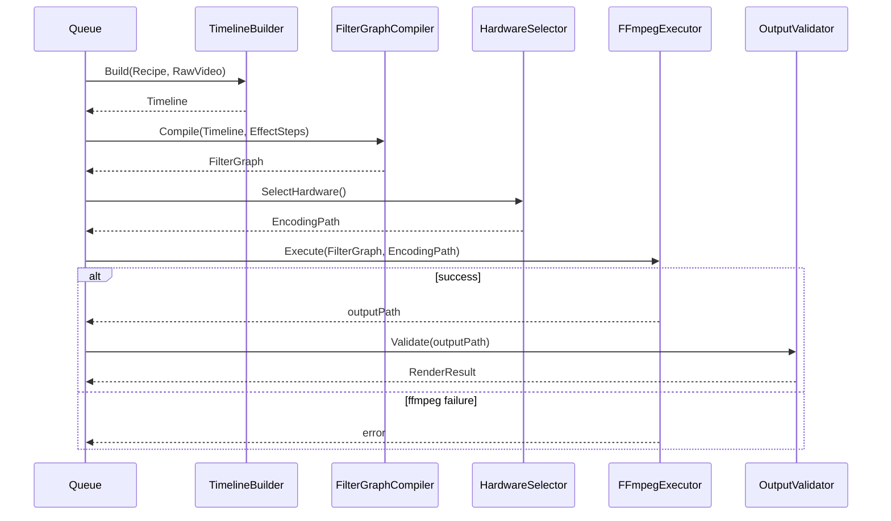
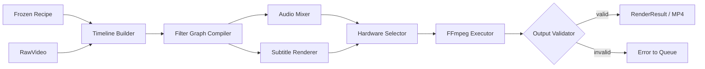

# Render

## Purpose

Render consumes a single Frozen Recipe plus its referenced RawVideo and produces a final MP4 output file. It is the only stage that touches FFmpeg. Render never makes creative decisions — every parameter it uses comes directly from the Recipe; Render only translates that declarative plan into an executable FFmpeg filter graph.

## Overview

Render is intentionally the "dumbest" stage in the pipeline: a pure function of `(RawVideo, Recipe) → MP4`. This is what allows Queue to treat every render as a stateless, retryable, horizontally scalable unit of work.

## Responsibilities

- Resolving a Recipe's ordered Effect Steps into a concrete FFmpeg filter graph
- Constructing the Timeline (segments, layers, tracks) described by the Recipe
- Applying audio mixing, subtitle rendering, and overlay composition as specified
- Choosing hardware acceleration (GPU/CPU) per configuration and availability
- Invoking FFmpeg and capturing its output, exit status, and logs
- Producing a final MP4 file plus a Render Result descriptor (output path, duration, checksum)

## Motivation

Isolating all FFmpeg interaction in one place means the rest of the system never needs FFmpeg-specific knowledge, and FFmpeg version/flag changes are contained to a single, testable boundary. It also means Render can be scaled across many stateless worker processes without any of them needing shared state beyond the Recipe and RawVideo they were handed.

## Scope

**In scope:** Filter graph construction, timeline/layer/track assembly, audio mixing, subtitle burn-in, hardware acceleration selection, FFmpeg process invocation, output validation.

**Out of scope:** Deciding what effects to apply (Recipe's job); scheduling/retries (Queue's job); where the output file is ultimately archived (Storage's job).

## Design Goals

| Goal | Description |
|---|---|
| Statelessness | A Render invocation depends only on its Recipe and RawVideo input — no shared mutable state across renders |
| Deterministic Translation | The same Recipe + RawVideo always produces the same filter graph (though FFmpeg encoding itself may have minor non-determinism) |
| Hardware Flexibility | Must run correctly on CPU-only environments and opportunistically use GPU acceleration when available |
| Fail Loud | An FFmpeg failure must surface a clear, attributable error — never a silently truncated or corrupt output treated as success |

## High Level Design

```
Recipe + RawVideo
        │
        ▼
  Timeline Builder (segments, layers, tracks)
        │
        ▼
  Filter Graph Compiler (per Effect Step, in order)
        │
        ▼
  Audio Mixer + Subtitle Renderer (as specified)
        │
        ▼
  Hardware Selector (GPU/CPU)
        │
        ▼
  FFmpeg Invocation
        │
        ▼
  Output Validator ──▶ RenderResult (MP4 + metadata)
```

## Architecture

```
+-----------------------------------------------------+
|                  Render Domain Core                   |
|  Timeline (v.o.) · FilterGraph (v.o.) · RenderResult   |
+-----------------------------------------------------+
        ▲               ▲                ▲
        │ port           │ port          │ port
+---------------+ +----------------+ +------------------+
| FilterGraph    | | HardwareSelector| | FFmpegExecutor  |
| Compiler(port) | | (port)          | | (port)          |
+---------------+ +----------------+ +------------------+
        ▲               ▲                ▲
+---------------+ +----------------+ +------------------+
| EffectStepToGraph| | GPUProbe      | | CLIFFmpegExecutor|
| (per-effect adap.)| | (adapter)     | | (adapter)        |
+---------------+ +----------------+ +------------------+
```

## Components

| Component | Responsibility |
|---|---|
| Timeline Builder | Assembles segments/layers/tracks from the Recipe's segment and effect definitions |
| Filter Graph Compiler | Converts each ordered Effect Step into its corresponding FFmpeg filter node, chained correctly |
| Audio Mixer | Resolves audio track layering (original audio, music, voiceover) per the Recipe |
| Subtitle Renderer | Burns in or muxes subtitle tracks as specified |
| Hardware Selector | Chooses GPU-accelerated or CPU-only encoding path based on availability and configuration |
| FFmpeg Executor | Invokes the FFmpeg process with the compiled graph and captures stdout/stderr/exit code |
| Output Validator | Confirms the produced MP4 is playable and matches expected duration/format before reporting success |

## Internal Flow

1. Render receives a Frozen Recipe and its referenced RawVideo (resolved via Storage).
2. Timeline Builder constructs the segment/layer/track structure from the Recipe.
3. Filter Graph Compiler walks the Recipe's ordered Effect Steps, translating each into FFmpeg filter syntax, respecting declared priority/order.
4. Audio Mixer and Subtitle Renderer contribute their respective filter/mux components.
5. Hardware Selector determines the encoding path (GPU if available and configured, else CPU).
6. FFmpeg Executor runs the assembled command, streaming logs.
7. On process success, Output Validator confirms the resulting file is valid; a `RenderResult` (output path, checksum, duration) is returned.
8. On process failure or invalid output, an attributable error is returned to Queue for retry classification.

## Sequence



## Data Flow



## Interfaces

- **Renderer** (invoked by Worker Dispatcher)
  - `Render(recipe Recipe, rawVideo RawVideo) (RenderResult, error)`
- **FilterGraphCompiler**
  - `Compile(timeline Timeline, steps []EffectStep) (FilterGraph, error)`
- **HardwareSelector**
  - `Select(config RenderConfig) (EncodingPath, error)`
- **FFmpegExecutor**
  - `Execute(graph FilterGraph, path EncodingPath) (outputPath string, error)`

## Dependencies

| Depends on | Why |
|---|---|
| Recipe (Frozen Recipe, Effect Step definitions) | Sole source of what to render |
| Download (RawVideo reference) | Source bytes to operate on |
| Effect / Plugin SDK (effect-to-filter mapping contracts) | Defines how each Effect ID maps to filter behavior |
| Storage | Where the output MP4 is written |
| Configuration | Hardware acceleration preferences, encoding presets |

**Depended on by:** Queue (Worker Dispatcher invokes Render per Job).

## Extension Points

- New Effects register their own `EffectStepToGraph` mapping without modifying the core Filter Graph Compiler loop.
- Alternative Hardware Selector strategies (e.g. cloud GPU pool vs local GPU) can be swapped via configuration.
- Alternative FFmpegExecutor adapters (e.g. containerized FFmpeg, remote render service) can replace the local CLI adapter behind the same port.

## Risks

- **Filter graph complexity limits** — very long Effect Step chains may produce filter graphs that exceed practical FFmpeg command-line/complexity limits. Mitigated by Recipe Optimizer collapsing redundant steps upstream, and by a documented maximum Effect Step count.
- **Hardware availability variance** — GPU acceleration may be unavailable or misconfigured on a given machine. Mitigated by Hardware Selector falling back to CPU automatically, with clear logging of which path was used.
- **Non-deterministic encoder behavior** — some encoders introduce minor non-determinism even with identical input; this must be documented as an accepted limitation, not treated as a Recipe bug.

## Best Practices

- Render must never read or write anything not explicitly described by the Recipe or RawVideo it was given — no hidden global configuration affecting output content.
- Every FFmpeg invocation's full command and exit status must be logged for reproducibility and debugging.
- Output Validation must always run before a render is reported successful — a zero-byte or truncated file must never be reported as `Completed`.

## Future Work

- Chunked/segmented rendering for very long sources to reduce peak memory usage.
- Render cost estimation exposed back to Queue for smarter scheduling.
- Distributed render worker pool across multiple machines.

## References

- Recipe.md
- Queue.md
- Download.md
