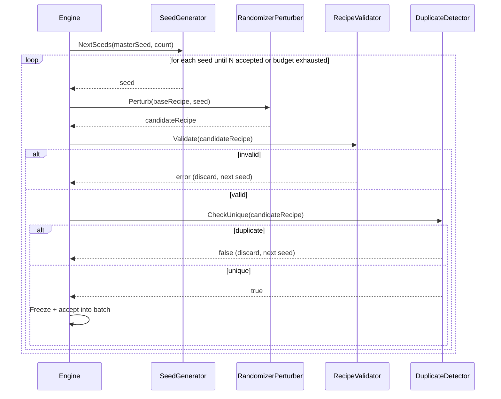
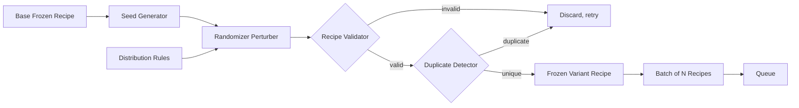

# Variant

## Purpose

Variant takes a single Frozen base Recipe and generates a configurable number of distinct, non-duplicate derivative Recipes — each a valid Recipe in its own right — so that one source video can produce hundreds to tens of thousands of visually/structurally unique outputs.

## Overview

Variant does not invent new effects or content; it perturbs the Recipe's exposed Randomizer Hooks (parameter ranges, optional steps, ordering choices) using a deterministic seed-based strategy, then validates each resulting Recipe through the standard Recipe Validator before accepting it. Uniqueness is enforced structurally, not just randomly hoped for.

## Responsibilities

- Generating N derivative Recipes from one base Recipe
- Managing seed generation and ensuring reproducibility (same seed sequence → same variant set)
- Enforcing duplicate prevention across the generated batch
- Applying distribution/weighting rules (e.g. "70% of variants should use effect A, 30% effect B")
- Ensuring every generated Recipe independently passes Recipe Validator before being accepted into the batch

## Motivation

Naively randomizing effect parameters per output without a formal Variant stage risks producing large numbers of near-identical or invalid outputs, wasting render compute. Treating variant generation as its own validated, deterministic process is what allows the system to make credible claims about generating thousands of *unique* videos rather than thousands of *renders*.

## Scope

**In scope:** Seed management, perturbation strategy, duplicate detection, distribution/weight rule application, per-variant validation delegation.

**Out of scope:** Defining what can be randomized (that's exposed by Recipe's Randomizer Hooks); actual rendering (Render); scheduling (Queue).

## Design Goals

| Goal | Description |
|---|---|
| Reproducibility | A given (base Recipe, seed sequence, count) always produces the same set of variant Recipes |
| Guaranteed Uniqueness | No two Recipes in one batch are structurally identical |
| Bounded Attempts | Duplicate/invalid generation attempts must not loop unboundedly; a hard cap with clear error reporting is required |
| Distribution Control | Callers can express weighted preferences over which optional effects appear across the batch |

## High Level Design

```
Base Recipe (Frozen)
        │
        ▼
   Seed Generator ──▶ Seed₁, Seed₂, ... Seedₙ
        │
        ▼
 for each Seed:
   Perturb Randomizer Hooks ──▶ Candidate Recipe
        │
        ▼
   Recipe Validator ──valid──▶ Uniqueness Check ──unique──▶ Accept
        │invalid                              │duplicate
        ▼                                     ▼
     discard, retry with next seed (bounded attempts)
```

## Architecture

```
+--------------------------------------------------------+
|                    Variant Domain Core                   |
|  VariantRequest (value object) · UniquenessKey (v.o.)     |
+--------------------------------------------------------+
        ▲                 ▲                  ▲
        │ port             │ port             │ port
+---------------+  +----------------+  +------------------+
| SeedGenerator |  | DuplicateStore |  | DistributionRules|
| (port)        |  | (port)         |  | (port)           |
+---------------+  +----------------+  +------------------+
        ▲                 ▲                  ▲
+---------------+  +----------------+  +------------------+
| PRNGSeedGen    |  | InMemoryHashSet|  | WeightedRuleSet  |
| (adapter)      |  | (adapter)      |  | (adapter)        |
+---------------+  +----------------+  +------------------+
```

## Components

| Component | Responsibility |
|---|---|
| Seed Generator | Produces a deterministic sequence of seeds from a master seed and batch index |
| Randomizer Perturber | Applies seed-driven changes to a base Recipe's exposed Randomizer Hooks |
| Duplicate Detector | Computes a structural uniqueness key per candidate Recipe and checks it against previously accepted keys in the batch |
| Distribution Rules | Weighted rules controlling how often optional effects/parameter ranges are selected across the batch |
| Uniqueness Store | Tracks accepted uniqueness keys for the current batch |
| Attempt Governor | Enforces a maximum retry count per slot before surfacing a generation failure |

## Internal Flow

1. Engine calls Variant with a base Frozen Recipe and a requested count N.
2. Seed Generator derives N (or more, to allow for retries) deterministic seeds from a master seed.
3. For each seed: Randomizer Perturber applies seed-driven perturbations to the base Recipe's hooks, producing a candidate Recipe.
4. Candidate Recipe is passed through the standard Recipe Validator (reused from Recipe module, not reimplemented).
5. If valid, Duplicate Detector computes its uniqueness key and checks against the Uniqueness Store.
6. If unique, the candidate is Frozen and accepted into the batch; if duplicate or invalid, Attempt Governor allows a bounded number of retries with the next seed in sequence.
7. Once N unique valid Recipes are collected (or the attempt budget is exhausted), Variant returns the batch.

## Sequence



## Data Flow



## Interfaces

- **VariantGenerator**
  - `Generate(base Recipe, count int, masterSeed Seed, rules DistributionRules) ([]Recipe, error)`
- **SeedGenerator**
  - `NextSeeds(masterSeed Seed, n int) ([]Seed, error)`
- **DuplicateDetector**
  - `UniquenessKey(recipe Recipe) (Key, error)`
  - `IsDuplicate(key Key) bool`
  - `Record(key Key)`

## Dependencies

| Depends on | Why |
|---|---|
| Recipe (Frozen base Recipe, Validator, Randomizer Hooks) | Variant only perturbs what Recipe already exposes; it never invents new fields |
| Configuration | Requested count, distribution weights, max retry budget |

**Depended on by:** Engine (fan-out step before Queue), Queue (consumes the resulting batch).

## Extension Points

- Alternative perturbation strategies can be plugged in behind `RandomizerPerturber` (e.g. genetic/evolutionary variation instead of pure random sampling).
- Alternative uniqueness key strategies (e.g. perceptual similarity of the *rendered* output rather than structural Recipe diff) can be added as a stricter, optional check.

## Risks

- **Combinatorial exhaustion** — if the base Recipe's Randomizer Hooks don't expose enough entropy, requesting very large counts (e.g. 50,000) may be structurally impossible to satisfy uniquely. Mitigated by the Attempt Governor surfacing a clear "insufficient entropy" error rather than looping forever or silently returning fewer than requested.
- **Weak uniqueness definition** — a purely structural uniqueness key might still allow visually near-identical outputs if two different parameter values produce imperceptible differences. Tracked as a future enhancement (perceptual uniqueness).

## Best Practices

- Never generate a variant Recipe by any means other than perturbing an already-Frozen, already-validated base Recipe.
- Uniqueness keys must be computed from the Recipe's semantic content, not its raw serialized bytes (to avoid false uniqueness from insignificant ordering differences).
- Always cap retry attempts explicitly; never allow an unbounded generation loop.

## Future Work

- Perceptual-similarity-based uniqueness checking on rendered output samples.
- Adaptive entropy expansion (auto-suggesting additional Randomizer Hooks when requested count exceeds available combinations).

## References

- Recipe.md
- Engine.md
- Queue.md
